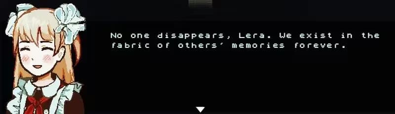

# _proj_Northen_place_
## INTRO

👉 [点击查看 ELC 项目页面](/ELC/dist/index.html)

早期设计是构建一个位于北极圈的雷达站，被用于作为前苏联的北冰洋监测站。

雷达站的设计图

冰层的渲染结果（最后没有用上）

粗略的故事板联想
## DIVE INTO THE COLDNESS

节选自《血，肉，混凝土》

在经过半个寒假的摸鱼后决定抛弃原来的设想，原因是自己没有能力从0开始构建一个非常庞大的整体建筑。于是决定换个思路制作一个小型的雷达监测站，位于某个北极城市中。

使用gaea制作的雪山，通过置换修改器导入高度图生成山体

图片->材质->uv映射->资产（上）早期预览（下）

## BUILD IT
开始制作非常多的资产，使用到了非常多blender的黑魔法，包括buildify这种节点生成建筑...

雷达站本体的最终渲染结果

step by step

最终成果！出院！
