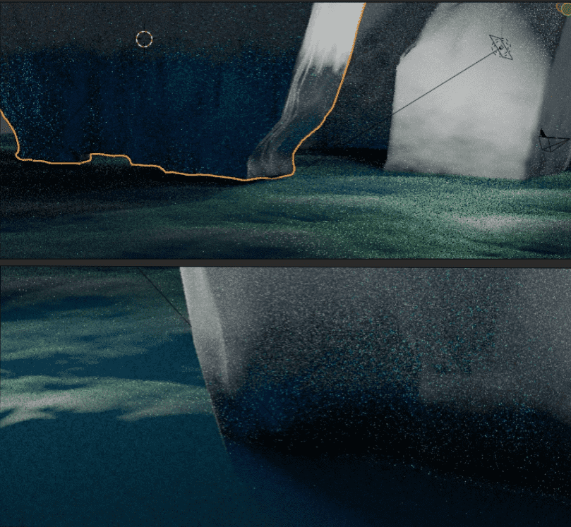
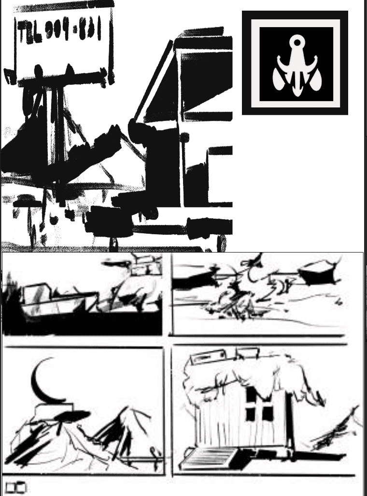
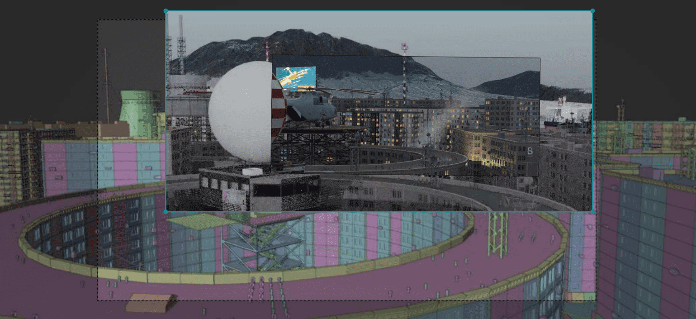
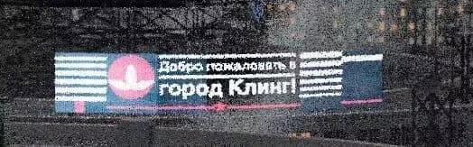

# _proj_Northen_place_
## INTRO

The initial concept was to build a radar station located in the Arctic Circle, used as a Soviet-era Arctic Ocean monitoring base.

Design blueprint of the radar station.

Ice layer rendering result (eventually not used).

Rough storyboard brainstorming.

## DIVE INTO THE COLDNESS

After a mostly idle winter break, I decided to abandon the original idea due to the difficulty of creating a large-scale building from scratch. I switched to designing a smaller radar monitoring station, located in a northern Arctic city.

Snow mountain generated using Gaea, terrain created by importing height maps via displacement modifiers.

Image → Material → UV Mapping → Assets  
(Top) Early preview  
(Bottom)

## BUILD IT

Started creating a large number of assets, using various Blender “black magic” tricks, including using node-based building generators like Buildify...

Final rendered result of the radar station structure.

Step by step.

Final result! 

